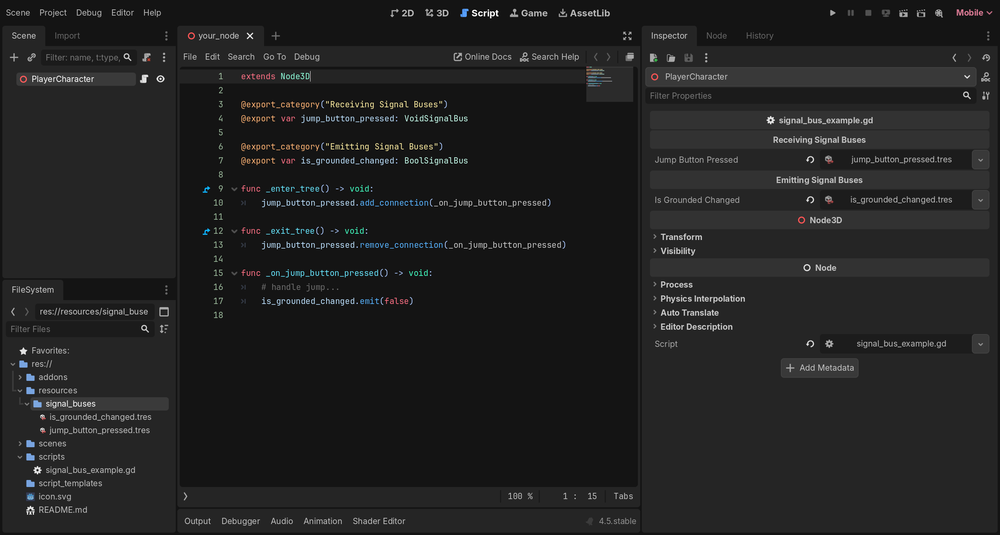
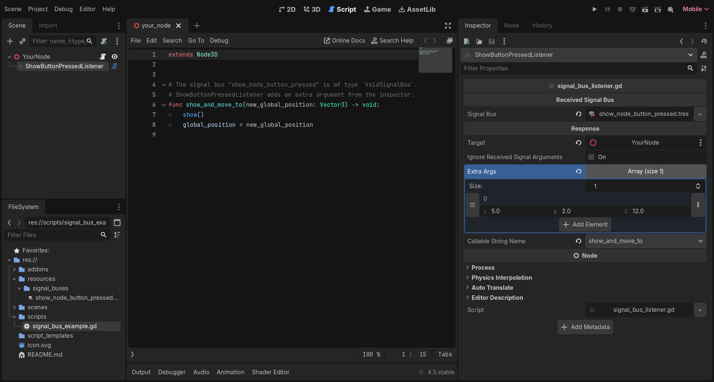

> ⚠️ This asset and document are still under construction.

# Resource Based Signal Bus

The objective of a _Signal Bus_ (usually known as "Event Bus" or "Event Channel") is to allow communication between objects without them being directly connected to each other. In _Godot_, a common approach of achieving this is by creating a [singleton](https://docs.godotengine.org/es/4.x/tutorials/scripting/singletons_autoload.html) that holds all the signals to be used by the nodes of the project. My intention is to offer an alternative approach inspired by the use of `ScriptableObject` as event channels in the _Unity3D_ engine. _(Learn about this [here](https://unity.com/how-to/scriptableobjects-event-channels-game-code) and [here](https://youtu.be/raQ3iHhE_Kk?si=c3nBhDf29gk7Mfma&t=1670))_

This asset allows for _ SignalBus_ resources to be created in the `res://` folder. These resources wrap a signal and can be assigned to any node straight from the inspector panel. Instead of connecting/emitting the signal in a singleton, the nodes connect/emit the signal inside the _ SignalBus_ resource they are given.

Some of the benefits of using this asset instead of regular signals or a singleton:

- ✅ **Decoupled and Maintainable design**: Emitter and receiver nodes do not hold references to each other. Signals are independent from the rest of the code. If a script needs to be refactored, renamed or split into smaller pieces, there is no need to fix connections to signals.

- ✅ **Modular and Scalable**: Scenes do not have to be modified to include new functionality. Any new scene that references an existing _ SignalBus_ will interact with the the rest of the scenes that already use it. 

- ✅ **Easy to Test**: These signal buses can be created and destroyed via code. Ensure a game component work as expected by creating temporary signal buses along with it instead of instantiating all of its dependencies. Assign the signal buses to the component and use them to emit or monitor signals.
	
- ✅ **Flexibility and Granularity**: Each signal bus resource is unique from the rest. A set of nodes can communicate using the same signal bus, or each have its own isolated one.

## 🧰 Features
- This addon comes with typed implementations for signals that take a single argument. These are based on common variant types in _Godot_: `VoidSignalBus`, `IntSignalBus`, `Vector3SignalBus`, `ArraySignalBus`, `NodeSignalBus`, ... 

> Custom signal buses can be created by extending the `SignalBus` class on a new script. The asset includes a [Script Template](./script_templates/SignalBus/custom_signal_bus_template.gd) to ease the process. **This allow signals using custom node types or multiple typed parameters** (e.g. _PlayerCharacterSignalBus_, _AduioClipFloatSignalBus_, _FloatFloatFloatSignalBus_...)

- The asset also features a new node named _ SignalBusListener_. It connects a _ SignalBus_ resource to a method of a `Node` in the scene. This allows designers and artists to create responses to signals from the inspector.

## ⬇️ Installation
1. Download the asset from the `AssetLib` tab in the Godot Editor.

2. Enable the plugin `Project` -> `Project Settings` -> `Plugins` -> `Resource Based Signal Bus`

## 📖 Usage

### Creating and using _ SignalBus_ resources.
1 - Right click on the _FileSystem_ panel, then select `Create New -> Resource`. A pop-up will open. In there, search for `SignalBus` and choose a type.

2- To emit a signal through a bus, export a variable that matches the type of _ SignalBus_ in a script. In the inspector panel,  choose the signal bus to use.  Then call the `emit(...)`method providing the required arguments.

3- To receive a signal from a bus,  export a variable that matches the type of _ SignalBus_ in a script.  In the inspector panel,  choose the signal bus to use. Then override the `_enter_tree()` and `_exit_tree()` methods and use them to connect and disconnect from to the signal bus using `add_connection(...)` and `remove_connection(...)`  and provide them with the callback to use for it.

>A screenshot of the Godot editor showing the code to emit and receive signals

### Using the _ SignalBusListener_ node.
1- Right click on the _Scene_ panel, then select `Add Child Node...`. A pop-up will open. In there, search for _ SignalBusListener_ and press _Create_.

2- In the inspector panel, select a _ SignalBus_ to listen to and a target node to send a response. The arguments from the received signal can be forwarded, ignored or extended by using the different available controls. Once the configuration for the arguments is ready, pick a compatible method from the _Callable String Name_ option button.

>A screenshot of the Godot editor showing the listener node responding to a signal and including extra arguments.

### Creating Custom Signal Buses.
1 - Right click on the _FileSystem_ panel, then select `Create New -> Script`. A pop-up will open. Fill in the different fields so the new class inherits `SignalBus` and uses the custom template included in the asset. Click _Create_.

![A screenshot of the script creation pop-up. In this case, I am going to create a signal that takes two arguments: an int and a Dictionary[String,Color]](./screenshots/create_script_pop_up.png)
> A screenshot of the script creation pop-up. In this case, I am going to create a signal that takes two arguments: an `int` and a `Dictionary[String,Color]` .

2- Once the new script is created, the editor will complain about several errors. This is because some placeholders in the class need to be changed to match the signature of our custom signal.

> A screenshot of the Godot editor showing a bunch of compiler errors when a custom `SignalBus` class is created.

> A screenshot of the Godot editor showing the custom `SignalBus` class after the placeholders have been replaced with the desired types.

3- Now, to create and use the new _ SignalBus_ type, simply follow [the steps above](#creating-and-using--signalbus-resources).

## 🐛 Limitations, known issues, bugs
Perhaps the biggest limitation of this project is the amount of work and repeated coding extending the `SignalBus` class takes. This is because I wanted each implemenentation of it to be as typed as possible. `GDScript` has no support for generic types, so I had to make some compromises when designing the structure of the asset files.

> I moved forward with this decision anyway because of the benefits of typed classes: error linting in the editor and the filtering of compatible methods when using the _ SignalBusListener_  node.
