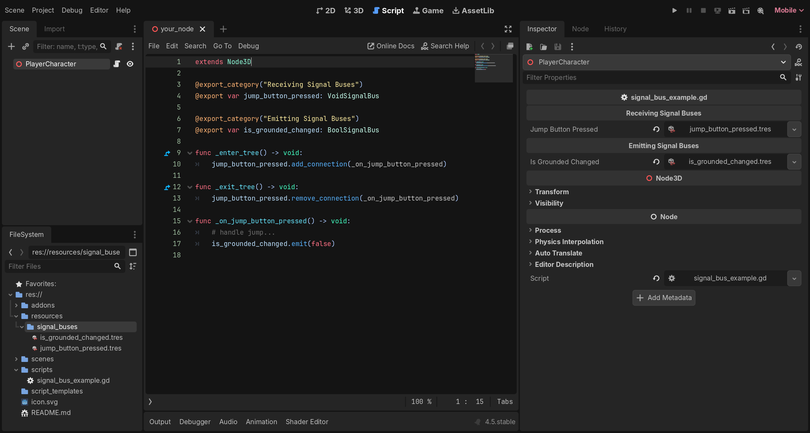
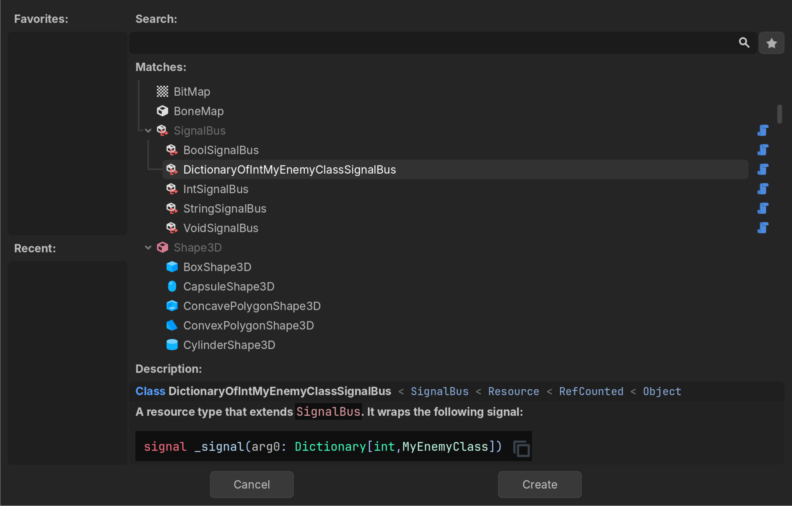
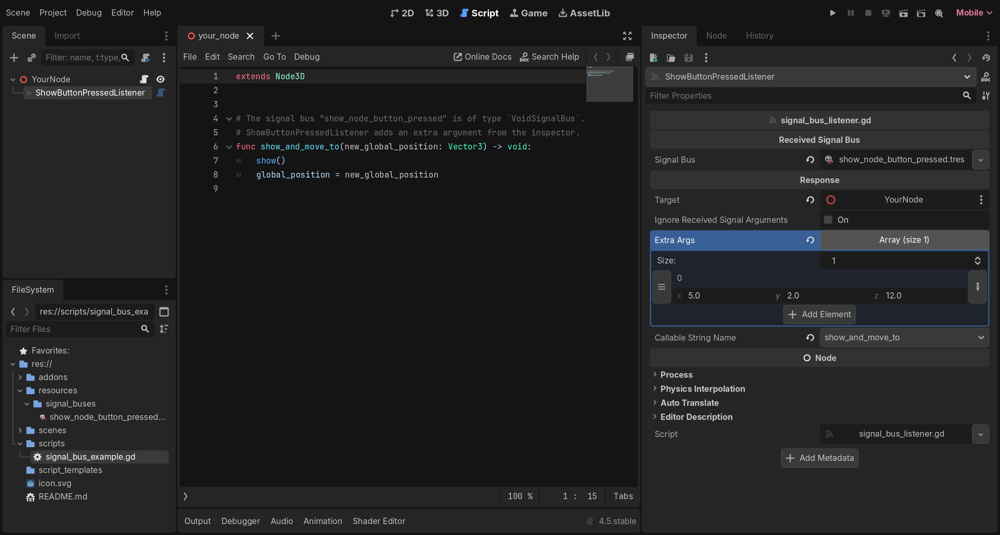

# Resource Based Signal Bus

[](https://godotengine.org/asset-library/asset/4352)
[](https://godotengine.org)
[](https://mastodon.gamedev.place/@camperotactico)
[](https://ko-fi.com/camperotactico)

A "Signal Bus" (usually known as "Event Bus" or "Event Channel") is a middleman in the [Observer Pattern](https://www.gameprogrammingpatterns.com/observer.html). It allows objects to send and receive events (or signals, in the case of _Godot_) without being directly referenced with each other.

In _Godot_, a common approach to achieve this is to create a [singleton](https://docs.godotengine.org/es/4.x/tutorials/scripting/singletons_autoload.html) that holds all the signals the nodes of a project can access. This asset offers a better, different approach.

Inspired by the usage of `ScriptableObject` assets as event channels in the _Unity3D_ engine _(learn about this [here](https://unity.com/how-to/scriptableobjects-event-channels-game-code) and [here](https://youtu.be/raQ3iHhE_Kk?si=c3nBhDf29gk7Mfma&t=1670))_, in this asset each signal is contained inside its own resource, a _ SignalBus_. These can be created and saved into the `res://` directory like any other resource type.



> A screenshot of the _Godot_ editor showing the code to emit and receive signals through signal buses.

Instead of connecting/emitting signals through a singleton, a node exports a variable that points to a _ SignalBus_ resource and connects/emits through it instead. Some of the benefits of using this approach over regular signals or a singleton are:

- ✅ **Decoupled and Maintainable Design**: Emitter and receiver nodes do not hold references to each other or to a global script. Signals are independent from the rest of the code. _If an emitting script needs to be refactored, renamed or split into smaller pieces, there is no need to fix broken connections on the receiving nodes._

- ✅ **Modular and Scalable**: Scenes do not have to be referenced or modified to include new functionality. _Any new node that references an existing  SignalBus will interact with the rest of the scenes that already use it._

- ✅ **Easy to Test**: Because these signal buses are resources, they can be assigned to variables, and they can be created, replaced and destroyed via code. _When writing tests, ensure a game component work as expected by creating and assigning temporary signal buses instead of instantiating all of its dependencies. Assign the signal buses to the component and use them to emit or monitor signals._
- ✅ **Flexible and Granular**: Each signal bus resource is unique from the rest, even if it shares the same _ SignalBus_ derived type. _A set of nodes can communicate using the same signal bus, or each have its own isolated one_.

- ✅ **More Visual**: Signals are now just another asset in the `res://` folder. _Designers and artists can use them in their scenes without any coding. On top of that, trying to delete a  SignalBus resource will warn about scenes that use them becoming orphan._

## 🧰 Features

The most basic element of this asset, the script that defines the resource class that wraps the signal, is nothing special. A simplified version of it would look something like this:

```gdscript
extends Resource

# The actual implementation in the asset is a bit more complex, as it makes use
# of the Godot 4.5 @abstract keyword and features an additional method to allow
# the included node "SignalBusListener" to respond to this resource in the inspector
class_name SignalBus

singal _signal()

func add_connection(callable: Callable) -> void:
  _signal.connect(callable)

func remove_connection(callable: Callable) -> void:
  _signal.disconnect(callable)

func emit() -> void:
  _signal.emit()
```

Copying that script into a project would replicate some of the functionalities and advantages of this asset. However, the project will be missing out on some of the goodies that I included to make the development easier:

- In this asset, each resource instance is typed. The `SignalBus` class itself is abstract, which means no resource can be created from it. To be able to create a resource, a typed script that extends `SignalBus` needs to be created. Out of the box, this addon comes only with a resource type for a signal with no arguments, `VoidSignalBus`.

- A _Custom SignalBus Script Creator_ tool is included to help define new resource types for signals that take one or more parameters. By default, this tool is displayed in the left upper right dock of the _Godot_ editor, next to the _Scene_ and _Import_ tabs.

- Custom implementations can be manually created as well by extending the `SignalBus` class on a new script. The package includes a [Script Template](./script_templates/SignalBus/custom_signal_bus_template.gd) to ease this process, but it still involves some manual work.

- The asset also features a new node named _ SignalBusListener_. Its purpose is to allow designers and artists to create responses to signals from the inspector. It connects a _ SignalBus_ resource to a method of a target `Node` in the scene. This new node allows to forward, ignore or add new arguments to the received signal. _ SignalBusListener_ filters and displays automatically the methods from the target `Node` that are compatible with the received (and modified) signal.

## ⬇️ Installation

1. Download the asset from the [AssetLib](https://godotengine.org/asset-library/asset/4352) tab in the Godot Editor.

2. Enable the plugin `Project` -> `Project Settings` -> `Plugins` -> `Resource Based Signal Bus`

## 📖 Usage

### Creating and using _ SignalBus_ resources.



> A screenshot of the _Create New Resource_ window of the Godot editor showing different signal bus types.

1. Right click on the _FileSystem_ panel, then select `Create New -> Resource`. A pop-up will open. In there, search for `SignalBus` and choose a type.

2. To emit a signal through its bus, export a variable that matches the _ SignalBus_ type in a script. In the inspector panel, choose the resource to use. Finally, call the `emit(...)` method providing the required arguments.

3. To receive a signal through its bus, export a variable that matches the _ SignalBus_ type in a script. In the inspector panel, choose the signal bus to use. Then override the `_enter_tree()` and `_exit_tree()` methods and use them to connect and disconnect from to the signal bus using `add_connection(...)` and `remove_connection(...)` and provide them with the callback to use.

### Using the _ SignalBusListener_ node.

1. Right click on the _Scene_ panel, then select `Add Child Node...`. A pop-up will open. In there, search for _ SignalBusListener_ and press _Create_.

2. In the inspector panel, select a _ SignalBus_ to listen to and a target node to send a response. The arguments from the received signal can be forwarded, ignored or extended by using the different available controls. Once the configuration for the arguments is ready, pick a compatible method from the _Callable String Name_ option button.

   

   > A screenshot of the Godot editor showing the listener node responding to a signal and including extra arguments.

### Creating Custom SignalBus Scripts From The Editor.

The easiest way to create a new script for a custom _ SignalBus_ type is to use the tincluded editor tool.

![A screenshot of the _CreateCustomSignalBusScriptEditor_ tab of the Godot editor. The tool is filled with parameters to create a custom signal bus type that wraps a `String,Array[Vector3]` signal.](./screenshots/create_custom_signal_bus_script_editor.png)

> A screenshot of the _CreateCustomSignalBusScriptEditor_ tab of the Godot editor. The tool is filled with parameters to create a custom signal bus type that wraps a `String,Array[Vector3]` signal.

1. In the Godot editor, click on the _CustomSignalBusScriptEditor_ tab on the right dock at the left side of the screen, next to the _Scene_ and _Import_ tabs.

2. Set the directory where the new script will be created to.

3. Set the number of arguments the contained signal will use.

4. Change the type of the arguments.

   > `TYPE_OBJECT`, `TYPE_ARRAY` and `TYPE_DICTIONARY` arguments will reveal an optional field where a specific type can be entered. In the above picture, the second argument references a `Vector3` typed `Array`. Arrays and dictionaries can feature nested arrays and dictionaries as well.
   >
   > As an example, to set a `Dictionary[int,Array[CharacterBody3D]]` typed argument, the variant type needs to be set to `TYPE_DICTIONARY` and the optional field to `int,Array[CharacterBody3D]`

5. Click the _ Create Script_ button.

6. To create and use the new _ SignalBus_ type, simply follow [the steps above](#creating-and-using--signalbus-resources).

### Creating Custom SignalBus Scripts Via Code.

1. Right click on the _FileSystem_ panel, then select `Create New -> Script`. A pop-up will open. Fill in the different fields so the new class inherits `SignalBus` and uses the custom template included in the asset. Click _Create_.

   ![A screenshot of the script creation pop-up. In this case, I am going to create a signal that takes two arguments: an int and a Dictionary[String,Color]](./screenshots/create_script_pop_up.png)

   > A screenshot of the script creation pop-up. In this case, I am going to create a signal that takes two arguments: an `int` and a `Dictionary[String,Color]` .

2. Once the new script is created, the editor will complain about several errors. This is because some placeholders in the class need to be changed to match the signature of our custom signal.

   

   > A screenshot of the Godot editor showing a bunch of compiler errors when a custom `SignalBus` class is created.

   

   > A screenshot of the Godot editor showing the custom `SignalBus` class after the placeholders have been replaced with the desired types.

3. To create and use the new _ SignalBus_ type, simply follow [the steps above.](#creating-and-using--signalbus-resources)

## 🐛 Limitations, known issues, bugs

Perhaps the biggest limitation of this project is that I haven't found a way to emit signals from the editor while the game is running. This would be an amazing addition which would ease the testing while developing a project.
